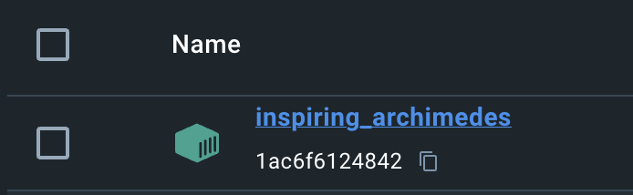
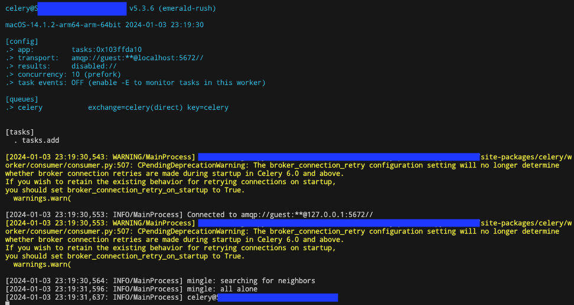

Celery
===
참고: https://docs.celeryq.dev/en/stable/getting-started/index.html


## Task Queue란?
Task queue는 스레드나 장비가 작업을 분배하는 매커니즘이다. 
Task queue의 input은 task로 불리는 작업 단위이다. 
전용 worker 프로세스는 수행할 새로운 작업이 있는지 Task Queue를 지속적으로 모니터링한다.

Celery는 메시지로 통신하며 broker를 통해서 worker와 client를 중재한다.
Task를 수행하기 위해서 clinet는 Task Queue에 메세지를 추가하고, broker는 worker에게 해당 메세지를 전달한다.

그리고 이러한 broker의 역할을 위해 RabbitMQ, Redis, AmazonSQS가 필요하다.
(실험적으로 Local 환경 개발을 위해 SQLite를 사용하는 것을 포함하여 여러 실험적인 도구를 사용할 수 있다고 한다.)

## Broker 선택

1. **RabbitMQ** : 배포 환경에서 Celery와 함께 사용하기에 좋다.
2. **Redis** : 갑작스러운 종료나, 정전 발생시 데이터 손실이 발생할 수 있다.
3. AWS SQS
4. SQLAlchemy
- [참고](https://docs.celeryq.dev/en/stable/getting-started/backends-and-brokers/index.html#broker-overview)

## Broker 설치 (RabbitMQ)
docker 환경에서 설치해서 사용했다.
``` sh
docker run -d -p 5672:5672 rabbitmq
```
</img>
(랜덤 이름으로 rabbitMQ container가 실행되었다.)


## Celery 설치
poetry를 통하여 Celery를 설치했고 5.3.6 버젼이 설치 되었다.
``` sh
poetry add celery
```

## Application
Celery instance를 Celery application 또는 줄여서 app으로 부른다.
Celery app은 Celery 수행하려는 모든 작업의 시작점이 되기 때문에 다른 모듈에서 이를 가져올 수 있어야 한다.
문서 튜토리얼에서는 단일 모듈에 모두 구현하지만 전용 모듈을 만드는 것이 좋다고 한다.

``` python
# tasks.py

from celery import Celery

app = Celery("tasks", broker="pyamqp://localhost:5672//")


@app.task
def add(x, y):
    return x + y
```

Celery의 첫번째 인자(`tasks`)는 현재 모듈의 이름으로 `__main__` 모듈에서 task들이 정의 될때 자동으로 이름이 생성될 때만 필요하다.

두번째 키워드 인자는 `broker`로 message broker의 URL을 입력해 주면 된다. RabbitMQ가 기본값이다.

마지막으로 `add`라는 하나의 task를 정의했다.

## Celery worker server 실행
`worker` 인자와 함께 실행시킬 수 있다.

``` sh
celery -A tasks worker --loglevel=INFO
```
</img>

결과값으로 다음 정보를 알려주고 있다.
1. celery 버젼, 실행 환경, 운영체제, 시간 정보
2. 설정값
   - 앱의 이름과 메모리주소, 
   - 브로커 주소
   - 결과를 받을 수 있는 백엔드 비활성화
   - 동시 작업 가능 수, 동시성 방식
   - 작업 이벤트 모니터링 상태
3. 큐 이름 교환방식, 라우팅 키
4. 정의된 task들

INFO로 브로커와 연결된 것 그리고 다른 워커를 찾지만 결국 찾지 못한 것까지 출력해주고 있다.

운영 환경에서는 대몬처럼 백그라운드에서 worker를 실행 시킬 수 있다. ([참고](https://docs.celeryq.dev/en/stable/userguide/daemonizing.html#daemonizing))


## task 호출
task를 호출하기 위해서 `delay()` 메소드를 사용할 수 있는데, 더 많은 제어가 가능한 `apply_async()` 메소드의 단축 방법(shortcut)이다.

python에서 task를 호출해보자.
``` python
from tasks import add

add.delay(4, 4)

# result
<AsyncResult: 6bb789c9-9667-4559-b4b8-e5a6d5132336>
```
AsyncResult 인스턴스를 반환 받았는데 이는 다음 동작이 가능하다.
- task의 상태를 확인
- task가 작업을 완료할 때까지 대기
- return 결과 get (error난 경우 exception과 Traceback)

물론 result는 기본값으로 사용할 수는 없고 result backend를 설정해야 한다.

## 결과값 보관
Task의 상태들을 추적하려면 Celery는 상태값을 어딘가 송신하거나 저장할 수 있어야 한다. SQLAlchemy/Django ORM, MongoDB, Memcached, Redis, RPC에서 몇 가지 내장된(built-in) Result backend를 선택 하거나 직접 정의할 수 있다.

rpc result backend를 사용해보자.
``` python
app = Celery("tasks", backend="rpc://", broker="pyamqp://")
```
(backend 인자를 통해 지정할 수 있다.)

가장 인기 있는 조합으로 backend로 Redis를 사용할 수도 있다.
``` python
app = Celery("tasks", backend="redis://localhost", broker**="pyamqp://")
```
자세한 backend 내용 [참고](https://docs.celeryq.dev/en/stable/userguide/tasks.html#task-result-backends)

이제 부터는 task를 요청했을 때 반환된 AsyncResult 인스턴스를 가지고 있을 수 있게 됐다.
``` python
>>> from tasks import add
>>> result = add.delay(4, 4)
```

`ready()` method는 task 처리가 완료되었는지 확인 할 수 있다.
``` python
>>> result.ready()
True
```
만약 작업이 완료되지 않았다면 False를 반환한다.

`get()` method를 통해 결과가 완료될 때까지 기다릴 수 있지만 비동기 호출을 굳이 동기 호출로 변환 되므로 거의 사용되지 않는다.

``` python
>>> result.get(timeout=1)
8
```
timeout 설정 값(sec) 안에 반환되지 않으면 `TimeoutError`를 발생시킨다.

만약 task 예외가 발생한 경우 get()은 예외를 다시 발생시키는데
propagate=False 인자를 추가하여 재정의할 수 있다.
``` python
>>> result.get(propagate=False)
```
또한, 에러가 발생한 경우에 Traceback도 접근이 가능하다.
``` python
>>> result.traceback
```

> Backend에서 리소스를 사용하여 결과를 저장하고 전송하는데 리소스 해제를 확실하게 하기 위해서는 모든 AsyncResult에 대해 `get()` 또느 `forget()` method를 호출해야 한다. 

## Configuration
Celery에는 입력과 출력이 있는데 입력은 반드시 broker와 연결되고 출력은 선택적으로 result backend와 연결될 수 있다. 하지만 면밀하게 back단을 확인해보면 slider, dial, button이 있다.

대부분의 상황에서 기본 설정값만 사용해도 충분히 좋지만 필요에 따라 정확하게 작동할 수 있도록 구성할 수 있는 옵션들이 많이 있다.   
예를 들어서 `task_serializer`설정을 변경하여 task payload 의 기본 serializer를 변경 할 수 있다.

``` python
app.conf.task_serializer = "json"
```
한번에 많은 구성을 변경할 경우 update를 활용 할 수 있다.
``` python
app.conf.update(
    task_serializer='json',
    accept_content=['json'],  # Ignore other content
    result_serializer='json',
    timezone='Asia/Seoul',
    enable_utc=True,
)
```
대규모의 프로젝트인 경우, `app.config_from_object()` method를 사용하여 중앙 집중화된  전용 설정 모듈을 사용하는게 좋다.
``` python
app.config_from_object('celeryconfig')
```
(celeryconfig 모듈 이름은 자유롭게 설정할 수 있다.)

위의 예시에 따라서 지정된 모듈인 celeryconfig.py는 현대 디렉토리나 python 경로에서 반드시 사용 가능해야 한다.

``` python
# celeryconfig.py

broker_url = 'pyamqp://'
result_backend = 'rpc://'

task_serializer = 'json'
result_serializer = 'json'
accept_content = ['json']
timezone = 'Europe/Oslo'
enable_utc = True
```
만약 해당 구성 파일이 제대로 작동하는지 확인 하려면 해당 파일을 불러보자.
``` sh
python -m celeryconfig
```
[Configuration and defaults](https://docs.celeryq.dev/en/stable/userguide/configuration.html#configuration)