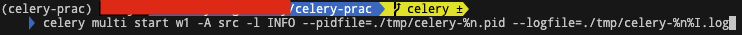
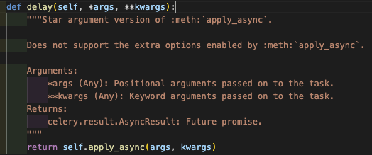

Application에서 Celery 사용하기
---
프로젝트 구조는 다음과 같다.
```
celery-prac/
    src/__init__.py
        /celery.py
        /tasks.py
```
worker를 실행하기 위해서 celery-prac 폴더에서 다음 명령어를 실행하면 된다.
``` sh
celery -A src worker -l INFO
```
`-b` 옵션을 통해서 broker의 url을 설정할 수 있다.  
`Concurrency`는 동시에 task를 처리하는데 사용하는 prefork worker의 갯수로 컴퓨터에 있는 CPU(core)에 따라서 default concurrency가 정해진다. 물론 `-c` 옵션을 통해서 수를 조정할 수 있지만 추천되지는 않는다.
만약 대부분의 작업이 I/O 작업이면 최적화해볼 가능성이 있다. CPU 2배 숫자를 설정했을 때, 드물게 효과적이였다. 하지만 대부분은 오히려 성능 저하를 일으킨다.

## 백그라운드 실행
운영환경에서 백그라운드 worker에서 운영하기 위해서 daemonization을 하기 위해서는 다음 [튜토리얼](https://docs.celeryq.dev/en/stable/userguide/daemonizing.html#daemonizing)을 확인하자.

`celery multi` 명령어를 사용하여 하나 이상의 worker를 실행시킬 수 있다.
``` sh
celery multi start w1 -A src -l INFO
```
>Mac에서 실행하면서 mkdir 권한의 문제로 pidfile과 logfile의 경로를 임시로 지정해줬다.


`restart`, `stop` 또한 가능하다.

``` sh
# restart
celery multi restart w1 -A src -l INFO
# stop
celery multi stop w1 -A src -l INFO
```

`stop` 명령어는 비동기적으로 수행되어서 worker가 작업 도중에 멈출 가능성이 있다. 그래서 `stopwait`을 사용하여서 현재 수행 중인 task를 수행하고 나서 다운 시킬 수 있다.
``` sh
celery multi stopwait w1 -A src -l INFO
```

## Calling Tasks 
task를 call하기 위해 `delay()` 메소드를 사용할 수 있다.
``` python
>>> from src.tasks import add
>>> add.delay(2, 2)
```
`delay()`는 `apply_async()` 메소드를 요청하는 숏컷(shortcut)이다.
내부 코드를 보면 확인 할 수 있다.

>  

다만 `apply_async()`를 사용하면 실행시간, queue 등 옵션을 설정할 수 있다.

```python
>>> add.apply_async((2, 2), queue='lopri', countdown=10)
# lopri라는 queue로 해당 task를 보내고 전송된후 10초 후에 해당 task가 실행된다.
```

현재 프로세스에서 task를 실행할 수도 있다.
``` python
>>> add(2, 2)
4
```

이 3가지 방법이 Celery calling API (Celery 호출 API)를 이루고 있다. 사용법에 대한 자세한 사항은 [다음 문서](https://docs.celeryq.dev/en/stable/userguide/calling.html#guide-calling)를 참고하자.

`delay`, `apply_async` 메소드는 `AsyncResult` 인스턴스를 반환하는데 이를 통해서 Task의 실행 상태를 추적할 수 있다.
물론 이것이 가능하기 위해서는 result backend를 구성해놔야 한다. 그렇다고 result backend가 task나 worker를 모니터링 할 수 있는 것은 아니다. flower(실시간 Celery 모니터) 등 자세한 내용은 [이 문서](https://docs.celeryq.dev/en/stable/userguide/monitoring.html#guide-monitoring)를 참고하자.

``` python
>>> res = add.delay(2, 2)
>>> res.get(timeout=1)
```

모든 task에는 uuid(task id)가 부여되는데 이 값 또한 확인 할 수 있다.

``` python
>>> res.id
'bb4528b7-3b4d-4b22-9e44-1c054d5fc899'
```

task에서 예외가 발생한 경우 Exception 및 traceback을 검사할 수도 있다. 실제로 `result.get()`은 기본적으로 모든 오류를 전파(`propagate`)한다.

``` python
>>> res = add.delay(2, '2')
>>> res.get(timeout=1)
Traceback (most recent call last):
  File "<stdin>", line 1, in <module>
  ...
TypeError: unsupported operand type(s) for +: 'int' and 'str'
```

만약 에러가 propagate 되는 것을 원하지 않으면, 해당 설정을 비활성화 하면 된다.
``` python
>>> res.get(propagate=False)
TypeError("unsupported operand type(s) for +: 'int' and 'str'")
```
이 경우 exception을 반환하기 전에 task가 성공/실패 여부를 다음 메소드를 통해 확인 할 수 있다.

``` python
>>> res.failed()
True
>>> res.successful()
False
```

task는 한가지 상태만을 가질 수 있는데 일반적으로 다음 순서로 진행된다.  

>PENDING -> STARTED -> SUCCESS

## Canvas: Work-flow 디자인

때론, task의 결과를 다른 프로세스로 전달하거나 다른 함수의 인자로 전달하고 싶은 경우가 있다. 이때 Celery에서 signatures를 사용하면 된다.

``` python
>>> add.signature((2, 2), countdown=10)
src.tasks.add(2, 2)
```

shortcut으로도 실행 할 수 있다.
``` python
>>> add.s(2, 2)
src.tasks.add(2, 2)
```

Signature 인스턴스는 API 호출(delay, apply_async)을 제공한다. 차이점은 인수를 사전에 지정할 수 있다는 것이다.
위에서 add는 2가지 인수를 가지기 때문에 2개의 인수를 지정할 수도 있다.
``` python
>>> s1 = add.s(2, 2)
>>> res = s1.delay()
>>> res.get()
4
```

하지만 partials 하게 불완전한 signature를 만들 수도 있다.
``` python
# incomplete partial: add(?, 2)
>>> s2 = add.s(2)
```
그래서 해당 signature를 다른 인수를 입력함으로써 완성시킬 수 있다.
``` python
# resolves the partial: add(8, 2)
res = s2.delay(8)
res.get()
10
```

### Groups
group은 task의 list를 병렬로 실행시켜 주고 그 결과를 순서에 맞게 반환해준다.
``` python
>>> from celery import group
>>> from src.tasks import add

>>> group(add.s(i, i) for i in range(10))().get()
[0, 2, 4, 6, 8, 10, 12, 14, 16, 18]

# Partial group
>>> g = group(add.s(i) for i in range(10))
>>> g(10).get()
[10, 11, 12, 13, 14, 15, 16, 17, 18, 19]
```

### Chains
chain은 Task를 연결하여 준다. 하나의 task의 return값을 다른 하나의 요청 인수로 적용할 수 있다.

``` python
>>> from celery import chain
>>> from src.tasks import add, mul

# (4+4) * 8
>>> chain(add.s(4, 4) | mul.s(8))() .get()
64

>>> (add.s(4, 4) | mul.s(8))().get()
64
```

### Chords
chord는 callback이 있는 group이다.
``` python
>>> from celery import chord
>>> from src.tasks import add, xsum

>>> chord((add.s(i, i) for i in range(10)), xsum.s())().get()
90
```

group에 다른 task를 chain하면 자동으로 chord로 변환된다.
``` python
>>> (group(add.s(i, i) for i in range(10)) | xsum.s())().get()
90
```