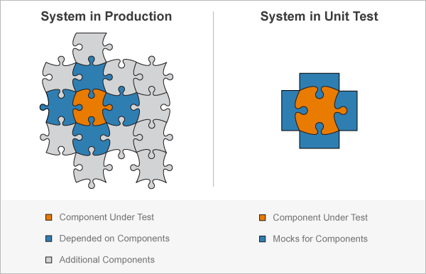

Mock Server
===

## Mock Object 란?

> In object-oriented programming, mock objects are simulated objects that mimic the behaviour of real objects in controlled ways, most often as part of a software testing initiative. 
> ([Wikipedia](https://en.wikipedia.org/wiki/Mock_object#Mocks,_fakes,_and_stubs)) 

Mock은 거짓된, 가짜의, 모조품 등의 의미를 포함하고 있다. 즉, `Mock Object`는 개발한 프로그램이 외부의 서비스나 모듈들을 실제로 사용하지 않고 실제의 모듈을 흉내내는 가짜모듈을 만들어 테스트의 효용성을 높이는데 사용하는 객체이다. 

## Mock Object 가 필요한 시점
실제 객체를 만들어서 사용하기에 자원이 너무 많이 소모되거나 객체간의 의존성이 커서 개발 구현이 오래 걸리는 경우 Mock 객체를 사용하면 좋다. 로직이나 서버 성능 등 다양한 이유로 동작이 오래걸리는 경우 시간 단축을 위해서도 사용 가능하다.

(출처 : https://www.crocus.co.kr/1555)

## Mock Server 란?
Mock Server 라는 용어의 정의를 Wiki에서 찾아 볼 순 없었지만 위의 Mock Object 내용과 [MockServer](https://www.mock-server.com/)라는 오픈소스의 설명을 빌려서 설명하자면 **사용자가 API들의 응답을 확인하고 테스트 하는데 실제 서버처럼 동작할 수 있는 가짜 서버를 의미한다고 할 수 있다.** API서버에서 자주 받을수 없거나 실제로 데이터를 받을 수 없는 등 특정한 상황에서 사용할 수 있다.

## Mock Server 사례
### Front End
   
App 개발 방식을 크게 세분화 하면 다음과 같이 나눌 수 있다.
1. 요구사항 분석/ 기획
2. BE 개발
3. FE 개발

위의 순차대로 개발이 이루어지면 좋겠지만 현실은 API 개발 기간이 예상보다 길어지는 등의 BE에서 API를 개발해야 진행 할 수 있는 상황들을 마주하고는 한다. 이때 Mock Server를 둔다면 Network 레벨의 Mocking을 진행 할 수 있다. ([참고](https://tech.kakao.com/2021/09/29/mocking-fe/))

### Back End
MSA 방식으로 개발할 때 Mock Server를 사용할 수 있다. 서비스간의 Open API처럼 동기화 할 수 있는 API 사양을 정의해두기만 하면 서비스를 개발을 위해 다른 서비스의 개발을 기다릴 필요가 없어진다. ([참고](https://saurav-samantray.medium.com/using-mock-servers-in-microservice-development-oversimplified-d0fdc9a6ef3f))

## 느낀점

  1. Mock Server를 선택하는데 많은 고민을 하지 말자. 다양한 Mock Server 라이브러리가 있지만 기능적으로 거의 비슷하기 때문에 사용법을 익히는데의 시간이 오히려 필요하다. ~~근데 난 많이 했당 데헷~~
  2. 무엇이든 과유불급이다. 만약 Mock Server에 과도하게 의존하고 있다는 것은 외부 API에 과도하게 연결되었다는 의미가 아닐까? 과도한 Mock 데이터 들을 만들 시간에 개발 하는게 유리할지도 모르겠다.

## 추가사항
### Mock vs Stub
`Mock Object`에 대해서 찾아보다가 `Stub`에 대해서도 알게 되었다.
>A method stub or simply stub in software development is a piece of code used to stand in for some other programming functionality. ([Wikipedia](https://en.wikipedia.org/wiki/Method_stub))

`Stub`은 다른 프로그래밍 기능을 대신하여 사용할 수 있는 코드 조각이다. `Mock`과 굉장히 유사한데 검증하고자 하는 것에 차이가 있다.
#### 상태검증 vs 행위검증
- 상태검증은 Method가 실행된 뒤에 객체의 상태값을 살펴 봄으로써 올바르게 동작했는지를 확인한다. 
- 행위 검증은 객체의 특정 메소드가 호출이 잘 되었는지에 대한 행위를 검사함으로써 올바른 동작을 확인한다. 

`Stub`은 상태검증에 중점을 둔 것이고, `Mock`은 행위검증에 중점을 둔 것이다.

자세한 내용은 [이 글](https://surgach.tistory.com/125)을 참고하면 좋을 것 같다.

(출처 : https://tecoble.techcourse.co.kr/post/2020-09-19-what-is-test-double/)

---
### Next Step
- Test Double
- TDD
- Pytest