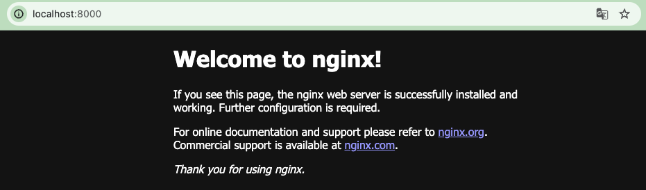

Terraform
===
인프라를 구성하고 여러명의 관리가 이루어지면서 인프라의 목적을 잃어 버리기도하고, 왜 사용되고 있는지 알 수 없게 되면서 앞으로 인프라를 코드로 관리해야할 필요성을 느끼게 되었다. 그래서 Terraform을 사용해보기로 하였고 한번 어떤 툴인지 살펴보자.

[참고](https://developer.hashicorp.com/terraform?product_intent=terraform)


## Terraform 작동 방식
Terraform은 cloud 플랫폼 등 기타 서비스의 API를 활용하여 리소스를 관리한다.

1. 쓰기 : 여러 클라우드, 서비스 업체의 리소스를 정의한다.
예를 들어 보안 그룹, 로드 밸런서를 사용한 VPC 네트워크에 앱 배포를 위한 가상 머신 설정을 작성할 수 있다.

2. 계획 : 기존 인프라 및 구성을 기반으로 생성/업데이트/삭제할 인프라를 설명하고 실행계획을 생성한다.

3. 적용 : 계획을 승인하면 종속성에 따라 설정된 작업을 수행한다.

>**IaC (Infrastructure as Code)**   
 IaC는 그래픽으로 구성된 유저인터페이스가 아닌 구성파일을 통해 인프라를 관리할 수 있다. 또한 인프라를 일관되고 변경 가능한 방식으로 생성, 변경, 관리가 가능하다.


 ## 설치
brew을 통해 설치가 가능하다.
``` sh
brew tap hashicorp/tap
brew install hashicorp/tap/terraform
```
 설치가 완료되었다면 명령어로 한번 확인해보자.

 ``` sh
terraform -help plan
 ```

### Tab completion
자동완성 패키지를 통해 Bash/Zsh를 사용한다면 Terraform 명령어를 Tab을 눌러 자동완성기능을 사용할 수 있다.   
쉘 설정 파일이 있는 상태에서 진행하자.

``` sh
terraform -install-autocomplete
```


## Quick start
Docker를 사용하여 1분 이내에 nginx서버를 프로비저닝 할 수 있다.

``` sh
mkdir learn-terraform-docker-container
cd learn-terraform-docker-container
```

작업 디펙토리에서 `main.tf`파일을 다음과 같이 작성하자.
``` tf
terraform {
  required_providers {
    docker = {
      source  = "kreuzwerker/docker"
      version = "~> 3.0.1"
    }
  }
}

provider "docker" {}

resource "docker_image" "nginx" {
  name         = "nginx"
  keep_locally = false
}

resource "docker_container" "nginx" {
  image = docker_image.nginx.image_id
  name  = "tutorial"

  ports {
    internal = 80
    external = 8000
  }
}
```

Terraform이 Docker와 상호작용이 가능하도록 프로젝트를 init하자.

``` sh
terraform init
```
`apply` 명령어를 통해 Nginx 서버 컨테이너를 프로비저닝하고 적용 여부를 요청할때 yes를 해보자.

``` sh
terraform apply
```

적용 후 localhost:8000에 접속하여 Nginx가 동작하는지 확인해봤다.
</img>

container를 멈추기 위해 destroy를 활용하자.

``` sh
terraform destroy
```

## [AWS](https://github.com/SonJi0507/study-log/tree/terraform/Terraform/src/learn-terraform-aws-instance)